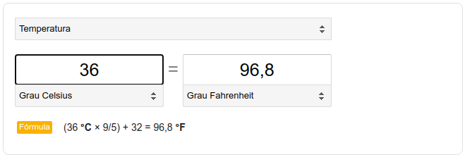

##### ORIENTAÇÔES
> Siga as orientações abaixo para resolver a tarefa

###### `index.html`
 - Faça a importação do arquivo styles.css na tag `<head>` e do arquivo main.js na tag `<body>`.
 - Crie uma tag `<h1>` com o texto `Conversão de Temperaturas`
 - Crie um `input` para informar a temperatura em Celsius

###### `styles.css`
 - Defina alguns estilos para a página
 
###### `main.js`

1. Faça um programa para converter a temperatura de Celcius para Fahrenheit e imprima as seguintes informações no arquivo `index.html`:
2. A conversão será feita toda vez que o usuário perder o foco do componente `input`. Para isso, utilize a função `blur`

> Veja a fórmula para fazer a conversão

